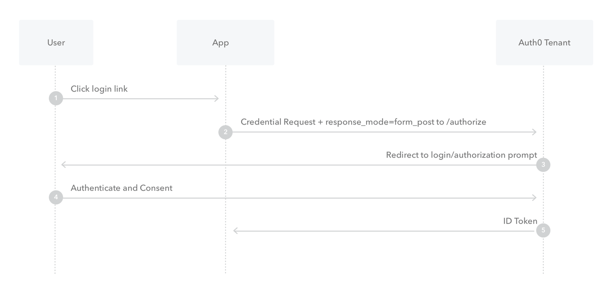

# OpenID Auth0 Grants Showcase

## Overview

This repository serves as a showcase for implementing the Implicit Grant flow with Auth0 and OpenID. The Implicit Grant flow is a secure and efficient way for single-page applications to obtain access tokens for authentication.

## Table of Contents

1. [Introduction](#introduction)
2. [Getting Started](#getting-started)
    - [Prerequisites](#prerequisites)
3. [Implementation Details](#implementation-details)
    - [Auth0](#auth0)
    - [OpenID](#openid)
    - [Implicit Grant Flow](#implicit-grant-flow)
    - [Additional Auth0 Configuration](#additional-auth0-configuration)
4. [Contributing](#contributing)
5. [Future Flows](#future-flows)
6. [Screenshots](#screenshots)
7. [License](#license)

## Introduction

This repository showcases the implementation of the Various Grant flows using OpenID and Auth0. The Implicit Grant flow is particularly useful for single-page applications, providing a seamless user experience while ensuring secure authentication.

## Getting Started

### Prerequisites

- [Node.js](https://nodejs.org/) installed
- Auth0 account ([Sign up here](https://auth0.com/))

## Implementation Details

### Auth0

[Auth0](https://auth0.com/) is a comprehensive identity and access management platform that allows developers to add authentication and authorization features to their applications easily. Auth0 provides a range of authentication and authorization mechanisms, including social logins, multi-factor authentication, and integration with various identity providers.

#### Key Features of Auth0:

- **Universal Login:** Auth0 offers a Universal Login page that provides a consistent and customizable authentication experience for users.

- **Identity Providers:** Auth0 supports integration with various identity providers, including social identity providers (Google, Facebook, etc.) and enterprise identity providers (Active Directory, LDAP, etc.).

- **Security:** Auth0 handles security aspects like password policies, brute force protection, and anomaly detection, providing a secure authentication environment.

- **Extensibility:** Auth0 allows you to extend its functionality through custom rules, hooks, and extensions.

### OpenID

[OpenID](https://openid.net/) is an open standard that allows users to be authenticated by co-operating sites using a third-party service. It is built on top of OAuth 2.0 and provides a standardized way for applications to authenticate users.

#### Key Concepts of OpenID:

- **Identity Provider (OP):** The service that authenticates the user and provides identity information to relying parties.

- **Relying Party (RP):** The application that relies on the identity provider to authenticate users.

- **User:** The person whose identity is being confirmed.

- **ID Token:** A JSON Web Token (JWT) that contains information about the authenticated user.

### Implicit Grant Flow

The Implicit Grant Flow is an OAuth 2.0 flow specifically designed for single-page applications (SPAs). It allows the client-side application to obtain access tokens directly from the authorization server, without the need for a backend server.

#### Steps in the Implicit Grant Flow:

1. **User Initiation:**
   The user access "/grant/implicit_grant/login" in the app.

2. **Redirect to Authorization Server:**
   The user is redirected to the Auth0 Authorization Server, passing necessary parameters such as client ID, scope, and redirect URI.

3. **User Authentication:**
   The user authenticates with the Authorization Server, which may involve logging in and granting consent to requested permissions.

4. **Token Response:**
   Upon successful authentication, the Authorization Server issues an ID token and an access token directly to the callbcak endpoint specified during the 2nd step "/grant/implicit_grant/callback".

5. **Token Usage:**
   The SPA can then use the obtained access token to make authorized API requests on behalf of the authenticated user.

6. **Validating Token:**
   Retrieve the dat of the user by accessing the "/grant/implicit_grant/profile" endpoint.

#### Additional Auth0 Configuration

To use the Implicit Grant Flow with Auth0, follow these additional configuration steps:

1. **Create an Auth0 Application:**
   Set up a new Auth0 application and configure it for Single Page Applications.

2. **Specify Allowed Callback URLs:**
   Define the callback URL(s) in the Auth0 dashboard to ensure secure redirection after authentication.

3. **Set Scopes:**
   Configure the scopes requested during the authentication process. Scopes determine the level of access the application is requesting.

Remember to include these details in your README to guide users through the setup process for your specific implementation. Additionally, provide clear instructions on where users can find and configure these settings in the Auth0 dashboard.

## Contributing

We welcome contributions! Feel free to submit issues or pull requests. 

## Future Flows

This repository is designed to accommodate additional authentication flows in the future. Contributions for other flows, such as Authorization Code or Device Flow, are highly encouraged.

